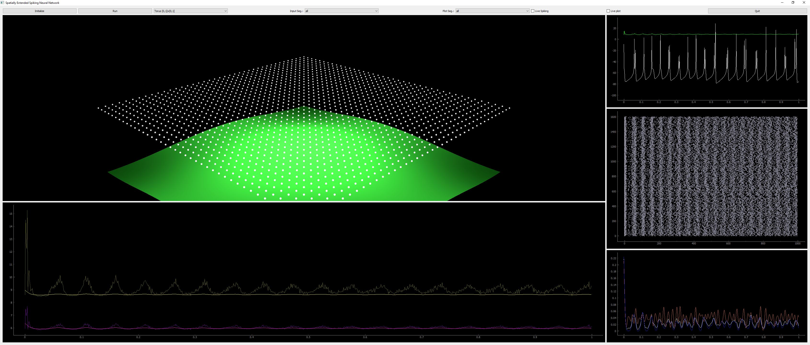

# snn_engine0

## Video

## Visualization

Ryan Pyle and Robert Rosenbaum (2017)
[_Spatiotemporal Dynamics and Reliable Computations in Recurrent Spiking Neural Networks_](https://www3.nd.edu/%7Errosenb1/Papers/PylePRL17Combined.pdf).
Physical Review Letters, 2017.

## New Version

[snn_engine2]()